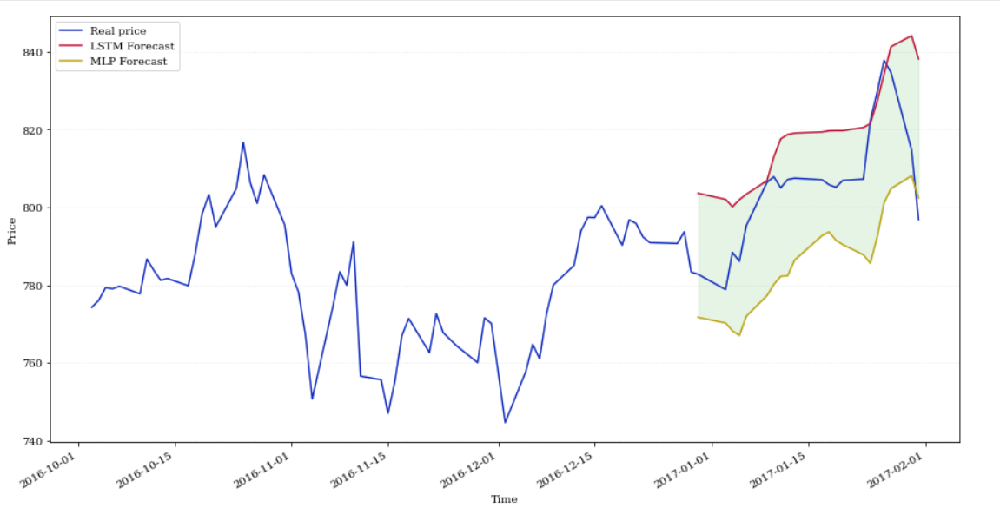

# Time Series Forcasting using Deep Learning 
Time series forecasting is one of the most important topics in data science. Almost every business needs to predict the future in order to make better decisions and allocate resources more effectively.

In this project I'll use two Deep Learning methods to forecast googles stock prices, I'll use an LSTM model & a Multilayer Perceptron.
Finally I'll visualize both forcasts compared to the real prices.

## Approach
The stock prices for a specefic day are going to be predicted from 60 previous time-steps.

I created and trained both models using Keras API. 
## Dataset
The training set is googles stock open prices from 2012-2016.

The test set is the open prices for the first month of 2017.
## Results

